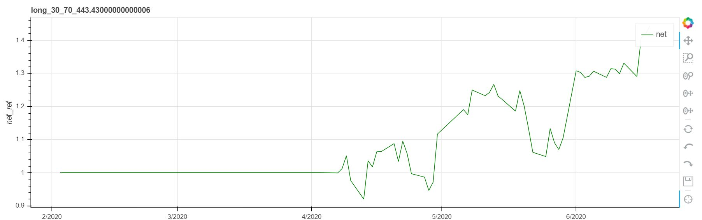

# 众米大数据软件营小组作业_2

## 小组成员 

电气中英1801-杨晨  
电气中英1801-刘琦  
电气中英1801-胡长昊  
电气卓越1801-严政  

### 总体描述
  
本程序是一个用于将获取的单支股票处理、清洗后的数据，经过重要参数计算，构建神经网络对股票进行数据分析与参数预测，并最终以可视化方式模拟进行量化交易的python程序。 
  
*This program is a python program used to process and clean the acquired single stock data, calculate important parameters, construct a neural network for data analysis and parameter prediction of stocks, and finally simulate quantitative trading in a visual manner.*  
  
#### 函数描述
  
```
StochRSI：用于计算股票的rsi值
KDJ：用于计算股票的KDJ值
```
#### 小组分工
**电气中英1801-刘琦**  
1. 在网上获取股票信息，导出csv文件。
   本例中用到了2015-2020的以岭药业，恒宝股份等等不同板块的股票。
2. 运用jqdata库采集数据，并进行双均线策略编写与回测分析。
   双均线策略:通过建立m天移动平均线，n天移动平均线，则这两条均线必有交点。若m>n，n天平均线“上穿越”m天均线则为买入点，反之为卖点。该策略基于不同天数均线的交叉点，抓住股票的强势和弱势时刻，进行交易。对于每一个交易日，都可以计算出前N天的移动平均值，然后把这些移动平均值连起来，成为一条线，就叫做N日移动平均线。一般有5日均线（MA5），10日均线（MA10）。

因此构建策略：认为双均线金叉的时候，表示股票很强势，反之很弱势，那么我们就在强势的时候买入，弱势的时候卖出即可
3. 整合readme.md及制作答辩PPT。

**电气中英1801-杨晨** 
1. 数据分析：将获取到的股票信息进行数据处理与分析，得出有用的特征值。
   主要计算出来未来的收益率、K值、RSI值，并对数据进行整理清洗，去除掉异常值与空值
2. 建立模型：利用神经网络建立股票预测模型。
   将数据分析得到的数据导入到神经网络中去进行训练，选取RSI为目标特征值，建立线性模型，回测2020年之后的RSI值，并与实际值进行测试对比。

最终将生成的RSI预测值导出到新的csv文件中。


**电气中英1801-胡长昊**  
1.  根据数据计算因子并依据因子进行策略制定和回测。
2.  根据组内成员的模型制定交易策略并进行回测。
   主要策略：当rsi向下穿过超卖线30，预测未来价格要回升，释放出买入信号；rsi向上穿过超买线70，预测未来价格有回落趋势，释放出卖出信号。

3.  进行相关内容的答辩展示。
4.  对结果进行评估与分析。

**电气卓越1801-严政**  
1. 探索了海龟交易系统的量化交易实践，尝试将其作为策略使用。最终部分问题没能完全解决，没能较好体现出成果。
    海龟交易法则：海龟交易法则涵盖了交易的各个方面，没有给交易员留下主观想象决策的余地，这正好使得程序化操作该系统的优势得到发挥。一方面计算唐奇安通道、股票波动幅度均值（ATR）、买卖单位后，策略保证即便当日投资标的跌幅达到N(ATR)的水平，当日的损失都能控制在1%的总资产水平内；另一方面设置止损标准，危及到本金时及时退市，从而保证本金的稳定与安全。
2. 帮助同学完善少量数据处理与保存的代码。
3. 制作说明文件。

### 安装     

为使程序正常运行需要**调用的库**包含：  
*The libraries that need to be called for the normal operation of the program include:*
```
jqdata、OS、json、numpy、pandas、math、bokeh、matplotlib、sklearn、tensorflow


```  


此外，主文件夹下如下**csv文件**被用于保存数据，请保证其位置与名称正确。  
*In addition, the following csv file in the main folder is used to save data, please ensure that its location and name are correct.*
```
#daydata.csv
raw_factor_data.csv
factor_data.csv
newdata.csv
```
### 用法
  
运行程序即可获取对应股票信息并绘制相应图表。  
*Run the program to get the corresponding stock information and draw the corresponding chart.*
```
分装函数功能或见相应文件夹中的Readme.md文件
```

### 联系方式
**QQ群：** *599539040*  

欢迎提出意见与拷贝文件。对于重大更改，请先打开一个问题以讨论您要更改的内容。  
*Pull requests and suggestions are both welcome. For major changes, please open an issue first to discuss what you would like to change.*

### 致谢

感谢网络开发者无私分享出的知识，并感谢训练营老师、助教所付出的努力。


